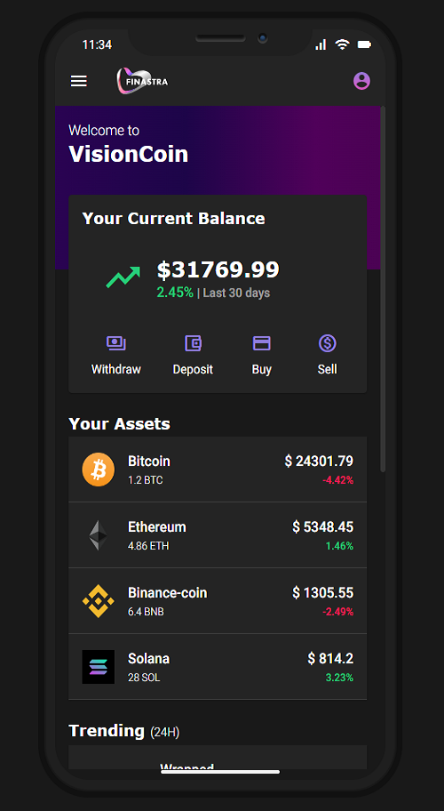
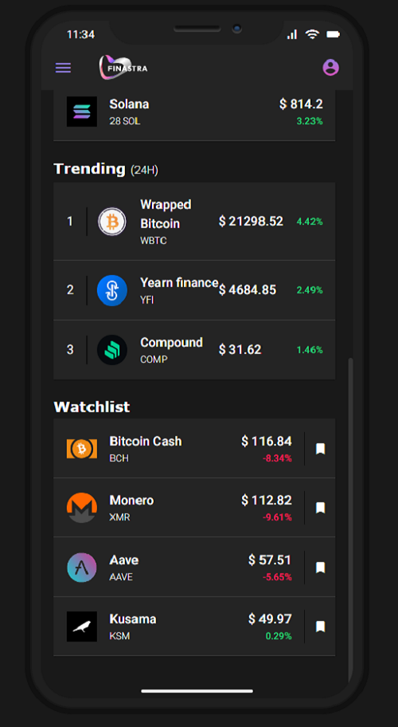
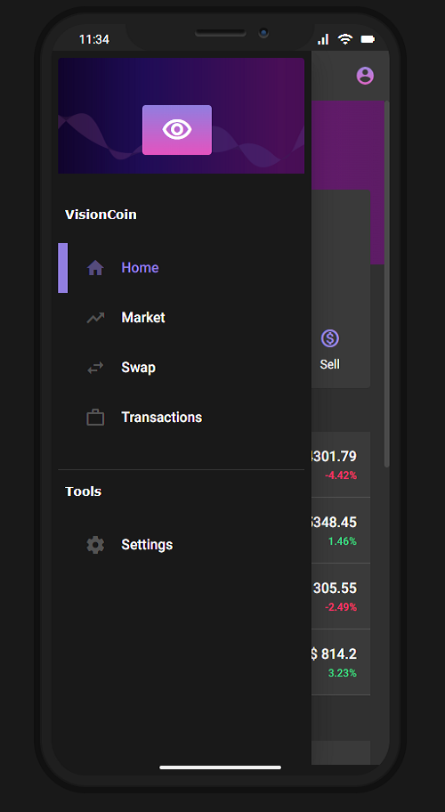
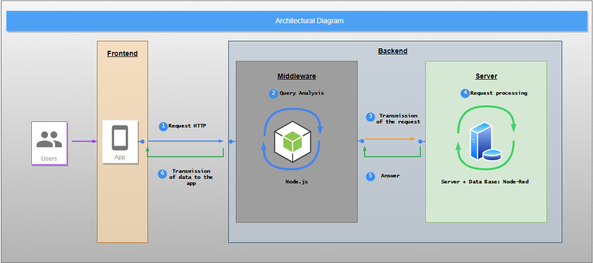

<h1 align="center">VisionCoin</h1>

<p align="center">
  
  
  <br>
  <br>
  <blockquote align="center"><h3></h3></blockquote>
</p>

<div align="center">
    Build with ❤️ using <b>Finastra Design System</b>
</div>

<br>

## 📸 User Interface



<br>

## 🧪 Try me out

> 👉 [VisionCoin](https://visioncoin-app.herokuapp.com/demo/portfolio)

<br>

## 🚀 Quick Start

```
npm install

npm start
```

For local development 👇

```
npm run dev

npm run start:server
```

<br>

## 🗺 Architectural Diagram



<br>

## 🌟 Features

<h3>
Client

</h3>

- Strict mode
- Lazy loading
- Smart and pure components pattern
- Self-contained components and encapsulated modules
- Components types (e.g. component, features)
- Amazing directory structure
- Unit tests with Jest instead of Karma & Jasmine
- Dark mode
- Migration from TSLint to ESLint
- GitHub Actions workflows for unit tests and build
  <!-- - Dynamic titles and content meta tags -->
  <!-- - PWA -->
  <!-- - i18n -->

<h3>
Server

</h3>

- Smart Logging (human-readable or JSON if console is not interactive)
- Proxy
- Auth ready

<br>

## Environement variables

| Variable       | Default value           |
| :------------- | :---------------------- |
| `PORT`         | `3000`                  |
| `NODE_RED_URL` | `http://127.0.0.1:1880` |

> Duplicate the `.env.template` and rename it to .env 👌🏼

<br>

## 🧙‍♂️ Commands

| Command        | Description                                                |
| :------------- | :--------------------------------------------------------- |
| `nx`           | See available commands                                     |
| `dev`          | Builds client in watch mode                                |
| `start:server` | Builds the server in watch mode                            |
| `start`        | Builds the client and then starts the server in watch mode |
| `build:prod`   | Builds both client and server in production mode           |
| `test:cov`     | Run test and outptus coverage                              |

<br>

_Below are some more advanced commands that might speed up your development flow:_

### Generate a library

Run `ng g @nrwl/angular:lib my-lib` to generate a library.

> You can also use any of the plugins above to generate libraries as well.

Libraries are shareable across libraries and applications. They can be imported from `@finastra/mylib`.

### Code scaffolding

Run `ng g component my-component --project=my-app` to generate a new component.

### Running unit tests

Run `npm t` to execute the unit tests via [Jest](https://jestjs.io).

Run `npm run test:cov` to execute the unit tests and output coverage.

Run `nx affected:test` to execute the unit tests affected by a change.

### Understand your workspace

Run `nx dep-graph` to see a diagram of the dependencies of your projects.

<br>

## Further help

- [Finastra's Developer Portal](https://developer.fusionfabric.cloud/documentation)
- [Finastra's Design System](https://design.fusionfabric.cloud)
- [Angular Documentation](https://angular.io/docs)
- [NestJS Documentation](https://docs.nestjs.com/)
- [Nx Documentation](https://nx.dev/angular)

<br>

[](https://www.finastra.com/)
